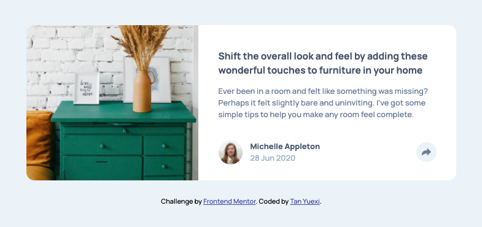

# Frontend Mentor - Article preview component solution

This is a solution to the [Article preview component challenge on Frontend Mentor](https://www.frontendmentor.io/challenges/article-preview-component-dYBN_pYFT). Frontend Mentor challenges help you improve your coding skills by building realistic projects.

## Table of contents

- [Overview](#overview)
  - [The challenge](#the-challenge)
  - [Screenshot](#screenshot)
  - [Links](#links)
- [My process](#my-process)
  - [Built with](#built-with)
  - [What I learned](#what-i-learned)
    - Change SVG color
    - Pop-up window
  - [Continued development](#continued-development)


## Overview

### The challenge

Users should be able to:

- View the optimal layout for the component depending on their device's screen size
- See the social media share links when they click the share icon

### Screenshot




### Links

- Solution URL: <https://github.com/tanyuexi/frontendmentor-article-preview-component/>
- Live Site URL: <https://tanyuexi.github.io/frontendmentor-article-preview-component/>

## My process

### Built with

- Semantic HTML5 markup
- CSS custom properties
- Flexbox
- Mobile-first workflow


### What I learned

#### Change SVG color

To change the color of an SVG, embed it in html file, and set `fill: <color>` for `svg` tag.

```
//html
<div class="pointer">
  <svg height="30" width="60">
    <defs>
      <filter id="shadow" x="0" y="0" width="200%" height="200%">
        <feDropShadow dx="0" dy="4" stdDeviation="4" flood-color="hsl(212, 23%, 69%)" flood-opacity="1" />
      </filter>
    </defs>
    <polygon points="15,0 45,0 30,15" style="stroke-width:0" filter="url(#shadow)" />
  </svg>
</div>

//css
.pointer svg {
  fill: red;
}
```

#### Pop-up window

Design the window, set `position: fixed; visibility: invisible;`, re-position it using javascript:

```javascript
var sharePopup = document.querySelectorAll(".share-active-desktop")[0];
var shareIcon = document.querySelectorAll(".share-icon")[0];

function positionSharePopup(){
  var rectShareIcon = shareIcon.getBoundingClientRect();
  var newTop = rectShareIcon.top;
  var newLeft = rectShareIcon.left;
  sharePopup.style.top = newTop + "px";
  sharePopup.style.left = newLeft + "px";
}
```

### Continued development

Learn about
